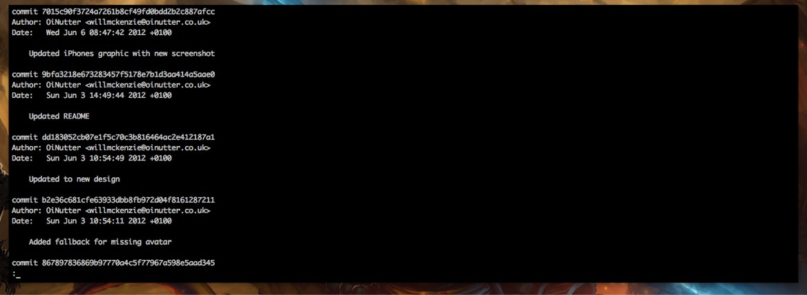

+++
date = "2017-02-22T08:38:53+01:00"
draft = false
title = "A better git log"
tags = ["git", "code"]

+++

I've just changed my git log command from the standard:



to the more compact and colorful:


It's simple to get this log. Just type in:

```shell
$ git log --graph --pretty=format:'%Cred%h%Creset -%C(yellow)%d%Creset %s %Cgreen(%cr) %C(bold blue)<%an>%Creset' --abbrev-commit
```

I guess that's a bit too long, eh? Let's just make an alias. Copy and paste the line below on your terminal:

```shell
$ git config --global alias.lg "log --color --graph --pretty=format:'%Cred%h%Creset -%C(yellow)%d%Creset %s %Cgreen(%cr) %C(bold blue)<%an>%Creset' --abbrev-commit"
```

And every time you need to see your log, just type in

```shell
$ git lg
```

Everything here is shamelessly copied from this article: https://coderwall.com/p/euwpig/a-better-git-log
