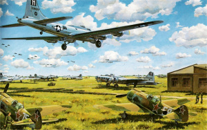
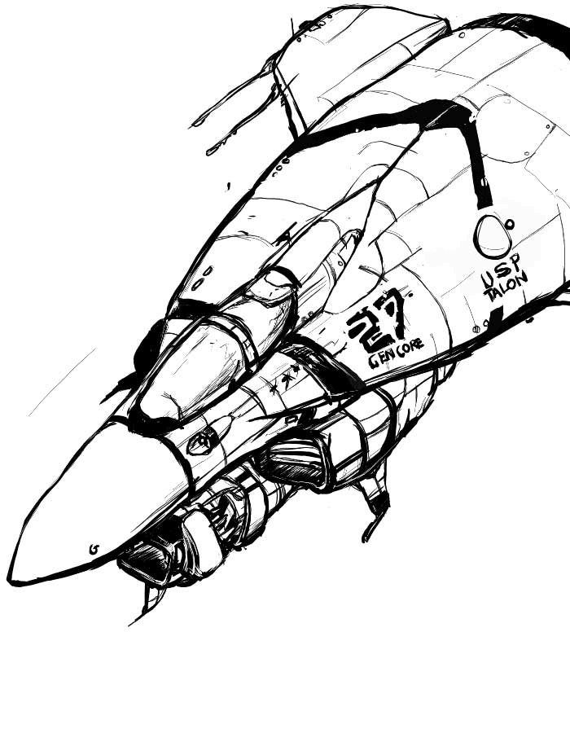
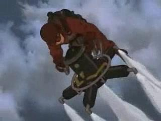

+++
date = "2013-05-25T13:20:12+02:00"
title = "Thoughts on the artstyle"
tags = ["spacehustler"]
+++

Since I started working on Space Hustler I’ve been thinking about what art style the game should have. The original lander had a sci-fi style and while that will work there are a lot of sci fi games and sci fi shooters especially are a dime a dozen. Partly because of this I’ve been thinking about designin a little bit different.

One idea I’ve been tossing around is the World War 2 with jet engines.

World war 2 inspirational image from [here](http://www.wallpapervortex.com/wallpaper-28123_aircraft_ww2_airplanes.html), or the following (I would assume) tyrian fan image from [here](http://siteinfo.org.uk/frozenreality.co.uk):

Another design would be steampunk a more inspired design, like from Steamboy. This would require removing or altering some weapons and defence like lasers and shields and replacing the jet engine with a propeller instead, but it would set the game apart from the original Lander in style and allow for more particle effects to be added, and everyone loves particles.

