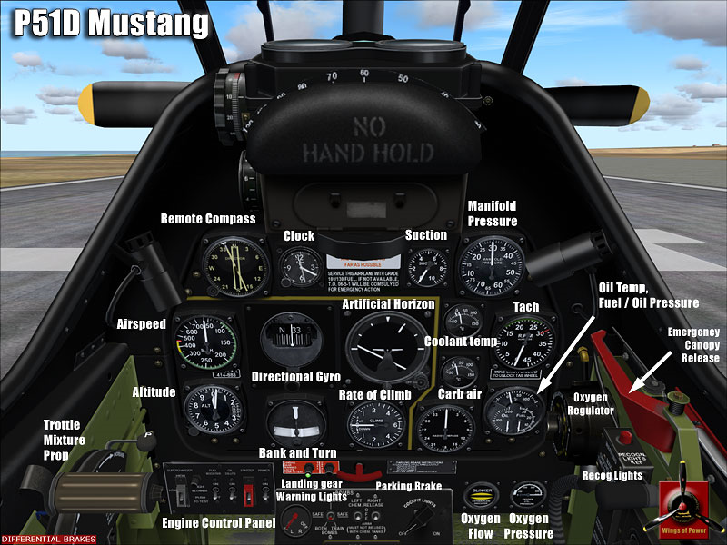
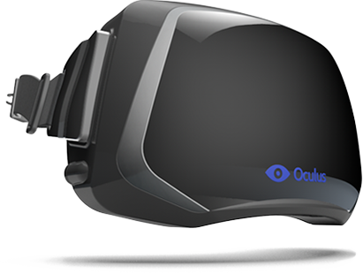

+++
date = "2013-06-08T13:31:22+02:00"
title = "A modern cockpit view"
tags = ["spacehustler", "vr"]
+++

I never really liked the cockpit view of flying and driving games. It provies a sense of realism for sure, but I never believed it provided me with a view that I liked. Enter E3 2012 and the demonstration of the Oculus Rift. Together with a helicopter like transparent sphere like cockpit the cockpit view field of view that the rift provides and the slow speed of the craft it provide a sense of realism few games can match.
the oculus rift

This solves the where you’re heading problem, but part of the game is also to avoid hitting walls. While things needs to be tested in game I have a few ideas, a system warning that emits audio when you are on a collision course with the environment, among others.
