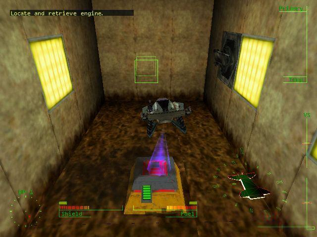
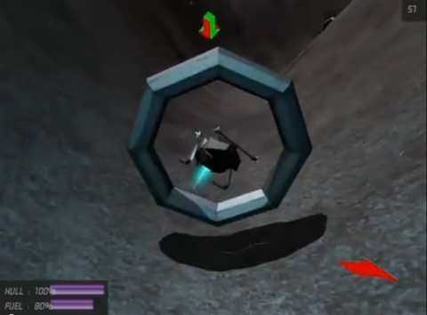

+++
date = "2013-06-01T13:25:01+02:00"
title = "Thoughts on mission types"
tags = ["spacehustler"]
+++

This week I’ve been thinking a lot about the different skirmish and mission types. The original lander basically had fetch an object and destroy missions. Hopper introduced “challenges” in the form of land without taking any damage and races, and while this could be expanded upon with acrobatical challenges(move through a narrow gap) and survival challenges (survive a meteor rain) I want to expand further in the mission and challenge/skirmish varieties.

As mouse and keyboard controls are more common now since the original lander was published and hacking in basic mouse support as a test in the WebGL I realised something. Controlling the craft isn’t as hard as I remembered. So adding a few enemy landers could be fun and all the standard shooting would apply such as deathmatch, capture the flag, king of the hill etc. This calls for more weapons than lander had (more on that in a later post) but I’ve been thinking about special mission types where there are intense dogfights but with a lander twist.

One twist that I’ve been entertaining is that the player pick up object with the tractorbeam, swing and then release at the enemy.

The other twist is a little more acrobatical, but the general idea is that only thing that can hurt the enemy is the flames from the major jet engine . While this might not be feasible it is an interesting dynamic that needs to be explored.
