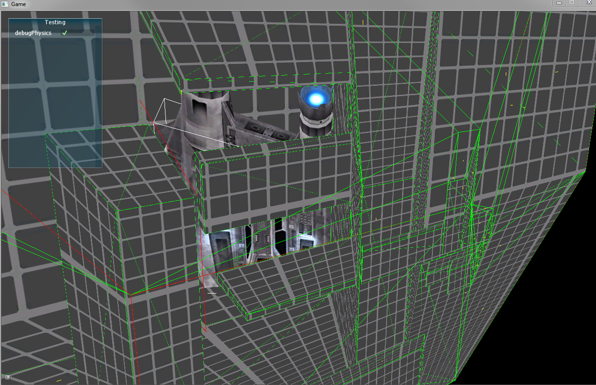

+++
date = "2013-09-07T13:48:53+02:00"
title = "Oculus development"
tags = ["spacehustler"]
+++
I’m in the middle of adding oculus rift support to my engine, this is what happens when you mix up your matrices:

