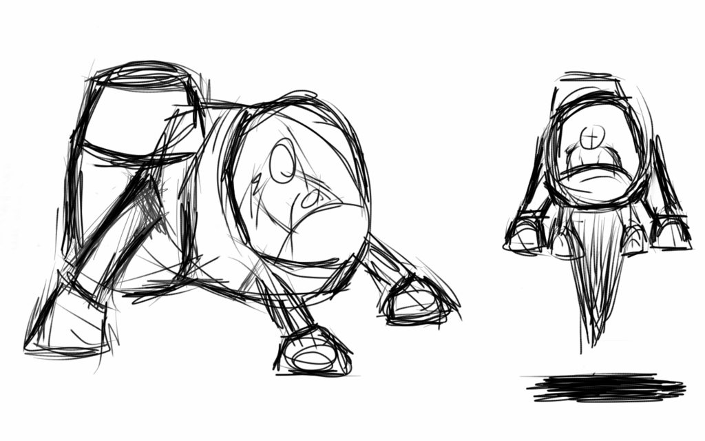
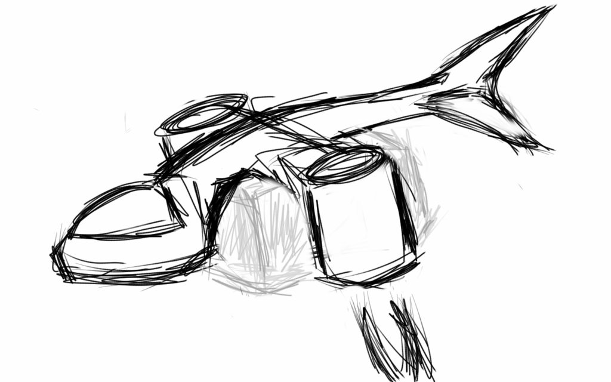
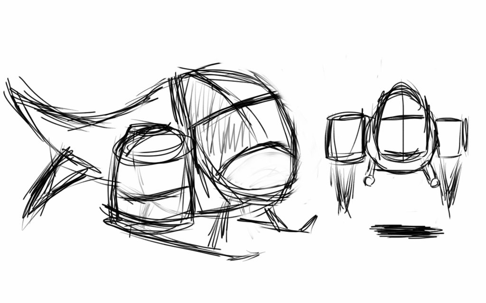
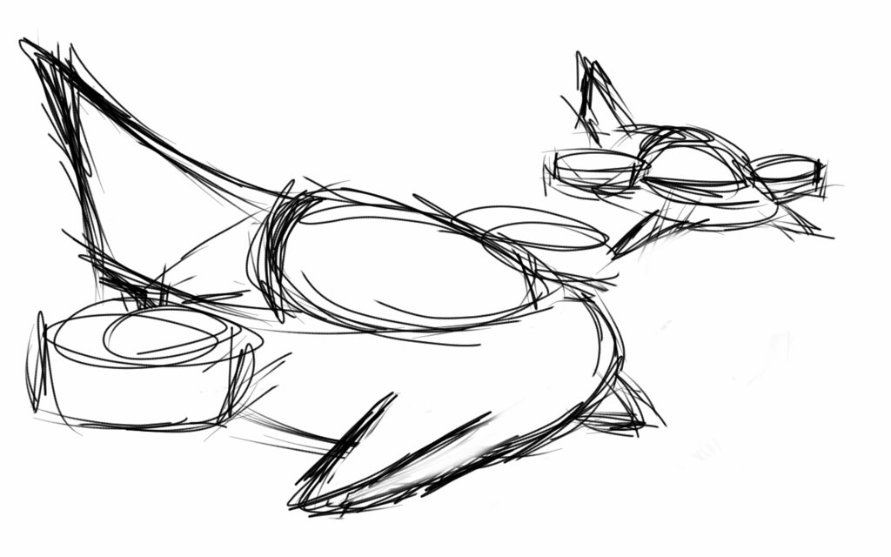

+++
date = "2013-09-01T13:45:20+02:00"
title = "Ship designs"
tags = ["spacehustler"]
+++
Bought myself a stylus and installed [sketchbook express](https://play.google.com/store/apps/details?id=com.adsk.sketchbookhdexpress&hl=en)
on my nexus 7 and sketched some lander ships, this is the result:

