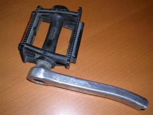
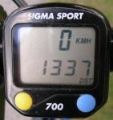

+++
date = "2009-07-14T11:22:52+02:00"
title = "Say, that's a nice bike"
tags = ["from wordpress", "fail"]
+++
So my bicycle have been trashed for some time now. Since Thursday actually. It really isnt a big deal unless I was attending No More Sweden and bicycle is my only viable transportation. I might have to rent one if it doesn’t get finished. It was actually supposed to be finished this Monday, but they are missing spare parts. That’s right, I bike hard.

Though my extreme/hard-biking might be beacuse I’m so

🙂

Considering my transportation the hardcore game-development, that I entered at the start of this week, hasn’t taken a all that serious blow. Yes I am behind schedule, but not that much. Considering I only had a black screen with no code whatsoever and I now have a almost complete level-loading, collision-detection and game-state code I am might proud 😉
